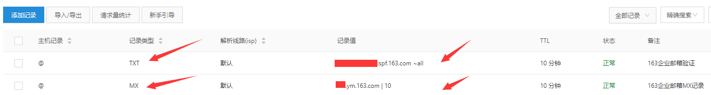
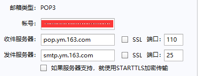

# 杂项解决方案

----

## 网易企业邮箱
  * 这里只涉及[免费企业邮箱](http://ym.163.com/)。

### 申请
  * 首先要有域名；
  * 按照[免费创建](http://app.ym.163.com/ym/reg/view/index)步骤进行填写。

### 设置MX记录验证
以阿里云为例：  

  * 然后等待网易审核。

### 新建用户
  * 网易审核通过后，[登陆免费企业邮箱](https://qiye.163.com/login/)，进行用户新建。

### 登陆自定义邮箱
手动设置邮箱服务。  

  * 填入网易企业邮箱创建的用户名和密码。